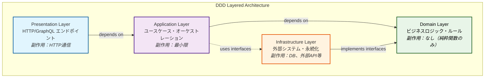
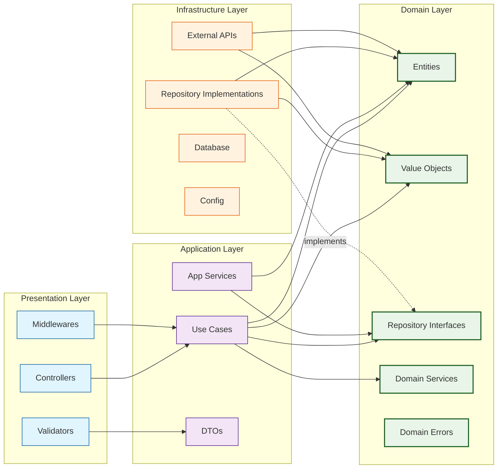

# バックエンド DDD アーキテクチャ設計

## 概要

本ドキュメントは、ドメイン駆動設計（DDD）と関数型プログラミングの原則を組み合わせたバックエンドアーキテクチャを定義します。

## 設計原則

### 1. ドメイン駆動設計（DDD）
- ドメインロジックをビジネスルールとして中心に配置
- レイヤードアーキテクチャによる関心の分離
- 各ドメインの独立性と境界の明確化

### 2. 関数型プログラミング
- 純粋関数の原則：同じ入力に対して常に同じ出力
- 副作用の最小化と終端への集約
- イミュータブルなデータ構造の活用

### 3. 副作用管理
- 副作用（DB操作、外部API呼び出し、ファイルI/O等）を終端層に集約
- ビジネスロジックから副作用を分離
- テスタビリティの向上

## アーキテクチャ構成

### レイヤー構成



### 依存関係の詳細図



### 各レイヤーの責務

#### Presentation Layer（表現層）
- **責務**: HTTP リクエスト/レスポンス処理、バリデーション
- **副作用**: あり（HTTP通信）
- **依存**: Application Layer

#### Application Layer（アプリケーション層）
- **責務**: ユースケースの調整、トランザクション境界
- **副作用**: 最小限（Infrastructure Layer経由のみ）
- **依存**: Domain Layer, Infrastructure Layer

#### Domain Layer（ドメイン層）
- **責務**: ビジネスルール、ドメインロジック
- **副作用**: なし（純粋関数のみ）
- **依存**: なし（他層への依存禁止）

#### Infrastructure Layer（インフラストラクチャ層）
- **責務**: 外部システム連携、データ永続化
- **副作用**: あり（DB、ファイル、外部API等）
- **依存**: Domain Layer（インターフェース実装のみ）

## ディレクトリ構成

```
src/
├── presentation/           # 表現層
│   ├── controllers/        # HTTPコントローラー
│   ├── middlewares/        # ミドルウェア
│   └── validators/         # リクエストバリデーター
├── application/            # アプリケーション層
│   ├── usecases/          # ユースケース
│   ├── services/          # アプリケーションサービス
│   └── dtos/              # データ転送オブジェクト
├── domain/                 # ドメイン層
│   ├── entities/          # エンティティ
│   ├── value-objects/     # 値オブジェクト
│   ├── repositories/      # リポジトリインターフェース
│   ├── services/          # ドメインサービス
│   └── errors/            # ドメインエラー
└── infrastructure/         # インフラストラクチャ層
    ├── repositories/      # リポジトリ実装
    ├── external/          # 外部API クライアント
    ├── database/          # データベース関連
    └── config/            # 設定ファイル
```

## クラス設計パターン

### Entity（エンティティ）
```typescript
// 純粋関数としてのメソッド定義
class User {
  private constructor(
    private readonly id: UserId,
    private readonly email: Email,
    private readonly name: UserName
  ) {}

  // 副作用なしの純粋関数
  public changeName(newName: UserName): User {
    return new User(this.id, this.email, newName);
  }

  public isActive(): boolean {
    return this.status === UserStatus.ACTIVE;
  }
}
```

### Repository Interface（リポジトリインターフェース）
```typescript
// ドメイン層では抽象的なインターフェースのみ定義
interface UserRepository {
  findById(id: UserId): Promise<User | null>;
  save(user: User): Promise<void>;
}
```

### Use Case（ユースケース）
```typescript
class UpdateUserNameUseCase {
  constructor(private userRepository: UserRepository) {}

  // 副作用は Repository 経由でのみ発生
  async execute(command: UpdateUserNameCommand): Promise<void> {
    const user = await this.userRepository.findById(command.userId);
    if (!user) {
      throw new UserNotFoundError();
    }

    // ドメインロジックは純粋関数として実行
    const updatedUser = user.changeName(command.newName);
    
    // 副作用を終端で実行
    await this.userRepository.save(updatedUser);
  }
}
```

## 依存関係の原則

### 依存性逆転の原則（DIP）
- 上位層は下位層の具象実装に依存しない
- インターフェースを通じた依存関係の管理
- Infrastructure Layer が Domain Layer のインターフェースを実装

### 依存関係のルール
1. **Domain Layer**: 他層への依存なし
2. **Application Layer**: Domain Layer のみ依存
3. **Presentation Layer**: Application Layer のみ依存  
4. **Infrastructure Layer**: Domain Layer のインターフェースのみ実装

## 次のステップ

このアーキテクチャ設計を基に、以下を展開予定：
1. 具体的なコード実装例
2. テストパターン
3. 副作用管理の詳細パターン
4. エラーハンドリング戦略