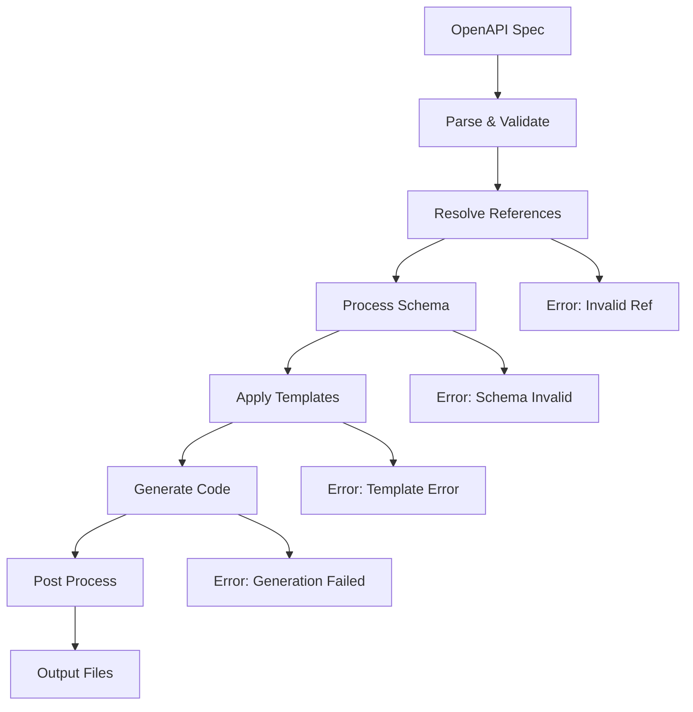

# Implementation Guides - OpenAPI 3.1.0 実装ガイド

## 📖 概要

OpenAPI 3.1.0ジェネレーターの実装パターン、ベストプラクティス、トラブルシューティングをまとめたディレクトリです。実装時の判断指針と問題解決方法を提供します。

## 📁 推奨ファイル構成

### 🎯 実装パターンガイド

| ファイル | 内容 | 対象者 |
|---------|------|--------|
| `generator-architecture-patterns.md` | ジェネレーター設計パターン | アーキテクト |
| `performance-optimization-guide.md` | パフォーマンス最適化 | 開発者 |
| `error-handling-strategies.md` | エラー処理戦略 | 開発者 |
| `testing-strategies.md` | テスト戦略 | QAエンジニア |

### 🔧 実装技術ガイド

| ファイル | 内容 | 対象者 |
|---------|------|--------|
| `template-engine-integration.md` | テンプレートエンジン統合 | 開発者 |
| `multi-language-support.md` | 多言語対応 | 開発者 |
| `plugin-architecture.md` | プラグイン機構 | アーキテクト |
| `configuration-management.md` | 設定管理 | DevOps |

### 🚨 トラブルシューティング

| ファイル | 内容 | 対象者 |
|---------|------|--------|
| `common-issues-solutions.md` | よくある問題と解決策 | 全員 |
| `debugging-techniques.md` | デバッグ技法 | 開発者 |
| `migration-guides.md` | バージョン移行ガイド | 全員 |

## 🏗️ ジェネレーター設計パターン

### 🎪 推奨アーキテクチャ

```
OpenAPI Generator
├── Parser Layer          # OpenAPI解析
│   ├── SchemaParser
│   ├── ReferenceResolver
│   └── ValidationEngine
├── Processing Layer      # 中間処理
│   ├── TypeMapper
│   ├── TemplateProcessor
│   └── CodeOptimizer
├── Generation Layer      # コード生成
│   ├── TemplateEngine
│   ├── FileGenerator
│   └── PostProcessor
└── Configuration Layer   # 設定管理
    ├── GeneratorConfig
    ├── LanguageConfig
    └── CustomConfig
```

### 🔄 処理フロー設計



## 📊 実装品質基準

### 🎯 必須品質項目

| 項目 | 基準 | 測定方法 |
|------|------|----------|
| **正確性** | 100% | 生成コードがスペック通り動作 |
| **完全性** | 95%+ | OpenAPI機能カバレッジ |
| **パフォーマンス** | < 5秒 | 中規模スペック処理時間 |
| **メモリ効率** | < 512MB | 大規模スペック処理時 |

### 🔥 推奨品質項目

| 項目 | 基準 | 測定方法 |
|------|------|----------|
| **可読性** | 高 | 生成コードの可読性スコア |
| **拡張性** | 高 | 新機能追加の容易さ |
| **保守性** | 高 | コード複雑度測定 |
| **テスタビリティ** | 高 | テストカバレッジ |

## 🧪 テスト戦略

### テストピラミッド
```
       /\
      /  \     E2E Tests (5%)
     /____\    - 実際のOpenAPIスペックでの統合テスト
    /      \   
   /        \  Integration Tests (25%)
  /__________\ - コンポーネント間連携テスト
 /            \
/              \
\              / Unit Tests (70%)
 \____________/  - 個別機能の単体テスト
```

### テスト種別と内容

#### Unit Tests (70%)
```typescript
// Parser単体テスト
describe('OpenAPIParser', () => {
  test('should parse basic OpenAPI spec', () => {
    const spec = { openapi: '3.1.0', info: { title: 'Test', version: '1.0.0' } };
    const result = parser.parse(spec);
    expect(result.info.title).toBe('Test');
  });
});

// TypeMapper単体テスト
describe('TypeMapper', () => {
  test('should map OpenAPI types to language types', () => {
    const openApiType = { type: 'string', format: 'email' };
    const languageType = typeMapper.mapType(openApiType, 'typescript');
    expect(languageType).toBe('string');
  });
});
```

#### Integration Tests (25%)
```typescript
// パーサー+ジェネレーター統合テスト
describe('Parser + Generator Integration', () => {
  test('should generate valid code from OpenAPI spec', async () => {
    const spec = loadTestSpec('user-api.yaml');
    const generatedCode = await generator.generate(spec, config);
    
    // 生成コードがコンパイル可能か
    const compilation = await compile(generatedCode);
    expect(compilation.errors).toHaveLength(0);
  });
});
```

#### E2E Tests (5%)
```typescript
// 実際のAPI運用テスト
describe('Generated Code E2E', () => {
  test('should work with real API server', async () => {
    // 生成されたサーバーコードでサーバー起動
    const server = await startGeneratedServer();
    
    // 生成されたクライアントコードでAPI呼び出し
    const client = new GeneratedApiClient(server.url);
    const result = await client.users.getUsers();
    
    expect(result.users).toBeInstanceOf(Array);
  });
});
```

## ⚡ パフォーマンス最適化

### 🎯 最適化ポイント

#### 1. 解析フェーズ
```typescript
// ❌ 非効率な解析
function parseSpec(spec: any): ParsedSpec {
  // 毎回全体を再帰的に走査
  return recursivelyParse(spec);
}

// ✅ 効率的な解析
class OptimizedParser {
  private cache = new Map();
  
  parseSpec(spec: any): ParsedSpec {
    // キャッシュ活用 + 必要部分のみ解析
    return this.parseWithCache(spec);
  }
}
```

#### 2. 参照解決フェーズ
```typescript
// ❌ 非効率な参照解決
function resolveReferences(spec: any): any {
  // 毎回ファイルI/O
  for (const ref of findRefs(spec)) {
    const resolved = readFileSync(ref.path);
    // ...
  }
}

// ✅ 効率的な参照解決
class ReferenceResolver {
  private refCache = new Map();
  private resolving = new Set(); // 循環参照検出
  
  async resolveReferences(spec: any): Promise<any> {
    // バッチ読み込み + キャッシュ + 並列処理
    const refs = this.collectAllRefs(spec);
    await this.batchLoadRefs(refs);
    return this.applyReferences(spec);
  }
}
```

#### 3. コード生成フェーズ
```typescript
// ❌ 非効率なコード生成
function generateCode(templates: Template[], data: any): string {
  let result = '';
  for (const template of templates) {
    result += processTemplate(template, data); // 毎回処理
  }
  return result;
}

// ✅ 効率的なコード生成
class CodeGenerator {
  private templateCache = new Map();
  
  generateCode(templates: Template[], data: any): string {
    // テンプレートコンパイルキャッシュ + 並列生成
    const compiledTemplates = this.getCompiledTemplates(templates);
    return this.parallelGenerate(compiledTemplates, data);
  }
}
```

### 📈 パフォーマンス監視

```typescript
// パフォーマンス測定
class PerformanceMonitor {
  private metrics = new Map();
  
  measure<T>(name: string, fn: () => T): T {
    const start = performance.now();
    const result = fn();
    const end = performance.now();
    
    this.metrics.set(name, end - start);
    return result;
  }
  
  getReport(): PerformanceReport {
    return {
      parsing: this.metrics.get('parsing'),
      referenceResolution: this.metrics.get('references'),
      codeGeneration: this.metrics.get('generation'),
      total: Array.from(this.metrics.values()).reduce((a, b) => a + b, 0)
    };
  }
}
```

## 🚨 エラーハンドリング戦略

### エラー分類と対応

#### 1. 入力エラー（ユーザー起因）
```typescript
class ValidationError extends Error {
  constructor(
    public field: string,
    public value: any,
    public constraint: string
  ) {
    super(`Validation failed for field '${field}': ${constraint}`);
  }
}

// 使用例
if (!spec.openapi) {
  throw new ValidationError('openapi', spec.openapi, 'required field');
}
```

#### 2. 処理エラー（内部エラー）
```typescript
class ProcessingError extends Error {
  constructor(
    public phase: string,
    public details: any,
    public originalError?: Error
  ) {
    super(`Processing failed in phase '${phase}': ${details}`);
    this.cause = originalError;
  }
}

// 使用例
try {
  const resolved = await resolveReferences(spec);
} catch (error) {
  throw new ProcessingError('reference-resolution', 'Circular dependency detected', error);
}
```

#### 3. 設定エラー（設定不備）
```typescript
class ConfigurationError extends Error {
  constructor(
    public configKey: string,
    public expectedType: string,
    public actualValue: any
  ) {
    super(`Invalid configuration for '${configKey}': expected ${expectedType}, got ${typeof actualValue}`);
  }
}
```

### エラー回復戦略

```typescript
class ResilientGenerator {
  
  async generateWithFallback(spec: any, config: Config): Promise<GenerationResult> {
    const errors: Error[] = [];
    
    try {
      // メイン処理
      return await this.generate(spec, config);
    } catch (error) {
      errors.push(error);
      
      // フォールバック1: 簡易モード
      try {
        console.warn('Falling back to simple mode due to error:', error.message);
        return await this.generateSimple(spec, config);
      } catch (fallbackError) {
        errors.push(fallbackError);
        
        // フォールバック2: 部分生成
        try {
          console.warn('Falling back to partial generation');
          return await this.generatePartial(spec, config);
        } catch (partialError) {
          errors.push(partialError);
          
          // 完全失敗
          throw new GenerationError('All generation strategies failed', errors);
        }
      }
    }
  }
}
```

## 🔧 デバッグ技法

### ログ戦略
```typescript
import debug from 'debug';

const log = {
  parser: debug('generator:parser'),
  resolver: debug('generator:resolver'),
  generator: debug('generator:generator'),
  performance: debug('generator:performance')
};

// 使用例
log.parser('Parsing OpenAPI spec: %o', spec.info);
log.performance('Reference resolution took %dms', duration);
```

### デバッグモード
```typescript
class DebugGenerator {
  constructor(private debug: boolean = false) {}
  
  async generate(spec: any, config: Config): Promise<GenerationResult> {
    if (this.debug) {
      // 中間ファイル出力
      await this.writeDebugFile('01-parsed-spec.json', spec);
      await this.writeDebugFile('02-resolved-refs.json', resolvedSpec);
      await this.writeDebugFile('03-template-data.json', templateData);
    }
    
    return this.doGenerate(spec, config);
  }
}
```

## 📈 実装完了の判定基準

### Phase 4完了チェック（実装品質）
- [ ] 全自動テストが通過（Unit + Integration + E2E）
- [ ] パフォーマンス基準をクリア
- [ ] メモリ使用量が基準内
- [ ] エラーハンドリングが適切
- [ ] ログ・デバッグ機能が充実

### プロダクション準備完了チェック
- [ ] 実際のOpenAPIスペックでの動作確認
- [ ] 大規模スペック（1000+ paths）での動作確認
- [ ] 複数言語/フレームワークでの動作確認
- [ ] ドキュメント整備完了
- [ ] バージョニング・リリース戦略確立

---

**🎯 最終目標**: 「エンタープライズグレードのOpenAPIジェネレーター」の実現。プロダクション環境で安心して使用でき、チーム開発を大幅に効率化するツールを目指しましょう。